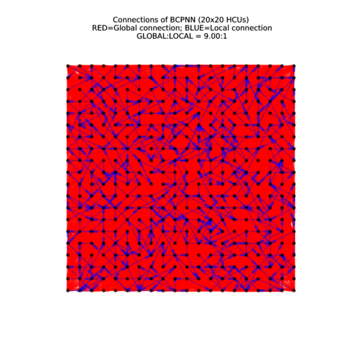
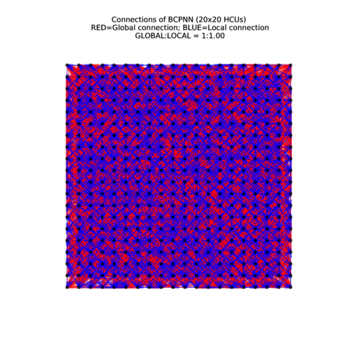
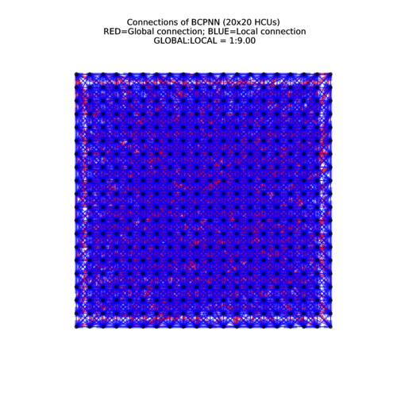

# Color switch test

## Purpose

Visualize the activity of internal mini-columns inside a BCPNN network with adaptation 
enabled and limited local connection.

## Metholoty

The tested BCPNN network has 400 HCUs to represent a 20x20 image. Each HCU has 10
MCU to represent 10 different possible colors of each pixel. The MCUs has adaptation
feedback enabled which will prevent it to keep exciting for too long. The
connectivity degree of each MCU will be limited to 6.25% so that a MCU will connect
to its 5x5 neighbor area if we limit all connections to be local connections. In
order to demostrate the effect of local connection degree, we will test 3 cases with
local connection rate equals to 10%, 50% and 90%.

Structural plasticity:

- Initialize connection according to external connection map.
- Never grow new connections.
- Never remove connections.
- Assign geometry coordinate according to external connection map.

Adaptation: Enabled

### Training

Every pattern is trained for 500 ms.

Pattern No. | Description
----------- | ------------------------------------------------------------------
1           | All pixel (HCU) in color 1
2           | All pixel (HCU) in color 2
3           | All pixel (HCU) in color 3
4           | All pixel (HCU) in color 4
5           | All pixel (HCU) in color 5
6           | All pixel (HCU) in color 6
7           | All pixel (HCU) in color 7
8           | All pixel (HCU) in color 8
9           | All pixel (HCU) in color 9
10          | All pixel (HCU) in color 10

### Test

Free running for 5s.

Expected behaviour are:

- No color will occupy the image for too long.
- With high local connection degree, the switch of color should start from some
point and spread to the whole image.

## Test results

Connection map for local connection rate equals to 10%.


Video recording for local connection rate equals to 10%.
<video width="500" height="500" controls>
	<source src="color_0.1.mp4" type="video/mp4">
	<source src="color_0.1.ogg" type="video/ogg">
Your browser does not support the video tag.
</video>

Connection map for local connection rate equals to 50%.


Video recording for local connection rate equals to 50%.
<video width="500" height="500" controls>
	<source src="color_0.5.mp4" type="video/mp4">
	<source src="color_0.5.ogg" type="video/ogg">
Your browser does not support the video tag.
</video>

Connection map for local connection rate equals to 90%.


Video recording for local connection rate equals to 90%.
<video width="500" height="500" controls>
	<source src="color_0.9.mp4" type="video/mp4">
	<source src="color_0.9.ogg" type="video/ogg">
Your browser does not support the video tag.
</video>

## Network configuration

````
# parameters for stimuli generation
gen_param{
	# stimuli file path
	stim_file : "../data/stimuli_color.bin"
	# delta t, the simulation step
	dt : 0.001
	# a small number to avoid log(0)
	eps : 0.001
	# simulation process defination
	mode_param : {
		begin_time : 0
		end_time : 5
		time_step : 500
		begin_lgidx_id : 1
		begin_wmask_id : 0
		lgidx_step: 1
		wmask_step: 0
		prn : 1
		plasticity: 0
	}
	mode_param : {
		begin_time : 5.0
		end_time : 10
		time_step : 500
		begin_lgidx_id : 0
		begin_wmask_id : 1
		lgidx_step: 0
		wmask_step: 0
		prn : 0
		plasticity: 0
	}
}

# parameters for network structure defination
net_param{
	# parameters for population
	pop_param : {
		# number of populations which share this parameters
		pop_num : 1
		# number of hypercolumn units in this population
		hcu_num : 400
		# time constant for membrance current (epsc).
		taum : 0.01
		# gain of soft winner-take-all (WTA)
		wtagain: 1
		# maximum firing frequency
		maxfq:100
		# gain of injected current (stimulus)
		igain:1
		# gain of sup
		wgain:1.0
		# bias of injected current (stimulus)
		lgbias: 0
		# normal distributed noise
		snoise: 0
		# number of minicolumn units per hypercolumn
		mcu_num : 10
		# maximum number of fanout for each minicolumn
		fanout_num : 25
		# adaptation gain
		adgain: 15
		# time constant of adaptation
		taua: 0.2
		# hypercolumn shape, any dimension (>0) is possible
		shape:20
		shape:20
		# absolute coordinate of the first hypercolumn in this population, any dimension (>0) is possible
		position: 0
		position: 0
		# the MPI rank id which will host this population
		rank: 0
	}
	
	# parameters for projection
	proj_param : {
		# the id of source population
		src_pop : 0
		# the id of destination population
		dest_pop : 0
		# time constant of zi, zi2 traces. tauzi, tauzj, taue and taup should be different.
		tauzi:0.005000
		# time constant of zj, zj2 traces. tauzi, tauzj, taue and taup should be different.
		tauzj:0.005001
		# time constant of e-traces. tauzi, tauzj, taue and taup should be different.
		taue:0.0050002
		# time condition of p-traces. tauzi, tauzj, taue and taup should be different.
		taup: 15
		# maximum firing frequency
		maxfq:100
		# gain of wij
		wgain: 1
		# gain of bj
		bgain: 1
		# maximum number of slot for each hypercolumn.
		slot_num : 810
		# time constant of epsc. By default tauepsc=tauzi
#		tauepsc: 0.05
	}
}

# parameters for logging
rec_param{
	# directory to store all logs
	directory: "../data/snapshot_color_0.5"
}

# parameters for procedure: ProcExtGen
# used for preparing stimulus
proc_param{
	name: "ProcExtGen"
}

# parameters for procedure: ProcUpdMulti
# used for performing the core update of BCPNN
proc_param{
	name: "ProcUpdMulti"
	# integer argument: spike buffer size
	# used for defining the history buffer size for spikes.
	argi: {
		key: "spike buffer size"
		val: 25
	}
}

# parameters for procedure: ProcExchangeSpike
# used for propagating spikes
proc_param{
	name: "ProcExchangeSpike"
}

proc_param{
	name: "ProcInitConn"
	args: {
		key: "conn-map-file"
		val: "../data/init_conn_0.5.map"
	}
}

# parameters for procedure: ProcSpkRec
# used for recording spikes
proc_param{
	name: "ProcSpkRec"
	# integer argument: period
	# the period of recording cycle
	argi: {
		key: "period"
		val: 1
	}
	# integer argument: offset
	# the first recording starts from this cycle
	argi: {
		key: "offset"
		val: 0
	}
}
````
