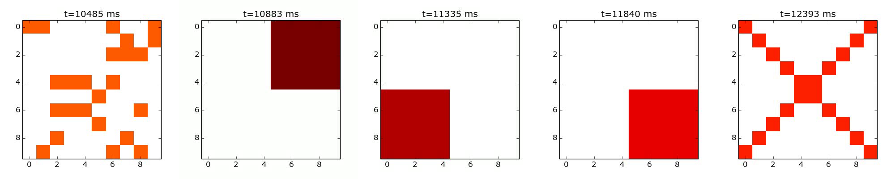

# Complex shape test

## Purpose

Visualize the activity of internal mini-columns inside a BCPNN network while 2 
trained patterns competing with each other.

## Metholoty

The tested BCPNN network has 800 HCUs to represent a 20x20x2 image. Each HCU has 40
MCU. 2 HCUs (80 MCUs) are used to represent each pixel. The color index is calculated
by equation:

$$
I_{color} = I_{HCU1} \times D_{MCU} + I_{HCU0}
$$

Where $I_{color}$ is the index of color, $I_{HCU0}$ and $I_{HCU0}$ are the active
MCUs index in HCU0 and HCU1, $D_{MCU}$ is the number of MCUs inside each HCU, according
to the configuration, $D_{MCU} = 40$.

A color map is generated based on the 10 training patterns. There are 1242 colors
in total, so we use 2 HCU with 40 MCU each to represent the color space. Since

$$
COLOR\_SPACE = 40^2 = 1600 > 1242
$$

Connectivity rate is set to be 3%.

Structural plasticity:

- Grow connections at every 100 ms.
- Remove connections at every 1000 ms.

Adaptation: Disabled

### Training


Pattern No. | Description
----------- | ------------------------------------------------------------------
1           | Gandalf
2           | Superman
3           | Spiderman
4           | E.T.
5           | Chunli
6           | Dumbledore
7           | Hulk
8           | Ironman
9           | Kenny
10          | Leonardo

### Test



Pattern No. | Winner
----------- | ------------------------------------------------------------------
1 vs 6      | 6
2 vs 7      | 2
3 vs 8      | 3
4 vs 9      | 4
5 vs 10     | 5

## Network configuration

````
gen_param{
	stim_file : "../data/simple.bin"
	dt : 0.001
	eps : 0.001
	mode_param : {
		begin_time : 0
		end_time : 5
		time_step : 500
		begin_lgidx_id : 1
		begin_wmask_id : 0
		wmask_step: 0
		lgidx_step: 1
		prn : 1
		plasticity: 1
	}
	mode_param : {
		begin_time : 5
		end_time : 10
		time_step : 500
		begin_lgidx_id : 1
		begin_wmask_id : 0
		wmask_step: 0
		lgidx_step: 1
		prn : 1
		plasticity: 1
	}
	mode_param : {
		begin_time : 10
		end_time : 10.2
		time_step : 200
		begin_lgidx_id : 0
		begin_wmask_id : 0
		wmask_step: 0
		lgidx_step: 0
		prn : 0
		plasticity: 0
	}
	mode_param : {
		begin_time : 10.2
		end_time : 10.5
		time_step : 300
		begin_lgidx_id : 11
		begin_wmask_id : 1
		wmask_step: 0
		lgidx_step: 0
		prn : 0
		plasticity: 0
	}
	mode_param : {
		begin_time :10.5
		end_time : 10.7
		time_step : 200
		begin_lgidx_id : 0
		begin_wmask_id : 0
		wmask_step: 0
		lgidx_step: 0
		prn : 0
		plasticity: 0
	}
	mode_param : {
		begin_time : 10.7
		end_time : 11.0
		time_step : 300
		begin_lgidx_id : 12
		begin_wmask_id : 1
		wmask_step: 0
		lgidx_step: 0
		prn : 0
		plasticity: 0
	}
	mode_param : {
		begin_time : 11
		end_time : 11.2
		time_step : 200
		begin_lgidx_id : 0
		begin_wmask_id : 0
		wmask_step: 0
		lgidx_step: 0
		prn : 0
		plasticity: 0
	}
	mode_param : {
		begin_time : 11.2
		end_time : 11.5
		time_step : 300
		begin_lgidx_id : 13
		begin_wmask_id : 1
		wmask_step: 0
		lgidx_step: 0
		prn : 0
		plasticity: 0
	}
	mode_param : {
		begin_time : 11.5
		end_time : 11.7
		time_step : 200
		begin_lgidx_id : 0
		begin_wmask_id : 0
		wmask_step: 0
		lgidx_step: 0
		prn : 0
		plasticity: 0
	}
	mode_param : {
		begin_time : 11.7
		end_time : 12.0
		time_step : 300
		begin_lgidx_id : 14
		begin_wmask_id : 1
		wmask_step: 0
		lgidx_step: 0
		prn : 0
		plasticity: 0
	}
	mode_param : {
		begin_time : 12
		end_time : 12.2
		time_step : 200
		begin_lgidx_id : 0
		begin_wmask_id : 0
		wmask_step: 0
		lgidx_step: 0
		prn : 0
		plasticity: 0
	}
	mode_param : {
		begin_time : 12.2
		end_time : 12.5
		time_step : 300
		begin_lgidx_id : 15
		begin_wmask_id : 1
		wmask_step: 0
		lgidx_step: 0
		prn : 0
		plasticity: 0
	}
}

net_param{
	pop_param : {
		pop_num : 1
		hcu_num : 100
		taum : 0.01
		wtagain: 1
		maxfq:100
		igain:1
		wgain:1.0
		lgbias: 0
		snoise: 0
		mcu_num : 10
		fanout_num : 100
		
		adgain: 0
		taua: 0.05
		
		shape:10
		shape:10
		rank: 0
	}
	
	proj_param : {
		src_pop : 0
		dest_pop : 0
		tauzi:0.005000
		tauzj:0.005001
		taue:0.0050002
		taup: 10
		maxfq:100
		wgain: 1
		bgain: 1
		slot_num : 500
		tauepsc: 0.005
	}
}

rec_param{
	directory: "../data/snapshot_simple"
}

proc_param{
	name: "ProcExtGen"
}
proc_param{
	name: "ProcUpdMulti"
	argi: {
		key: "spike buffer size"
		val: 25
	}
}

proc_param{
	name: "ProcExchangeSpike"
}


proc_param{
	name: "ProcStructuralPlasticity"
	argi: {
		key: "period"
		val: 100
	}
	argi: {
		key: "pruning-period"
		val: 100000
	}
	argi: {
		key: "t-th"
		val: 50000
	}
	argi: {
		key: "enable-geometry"
		val: 0
	}
}

proc_param{
	name: "ProcSpkRec"
	argi: {
		key: "period"
		val: 1
	}
	argi: {
		key: "offset"
		val: 0
	}
}
````
